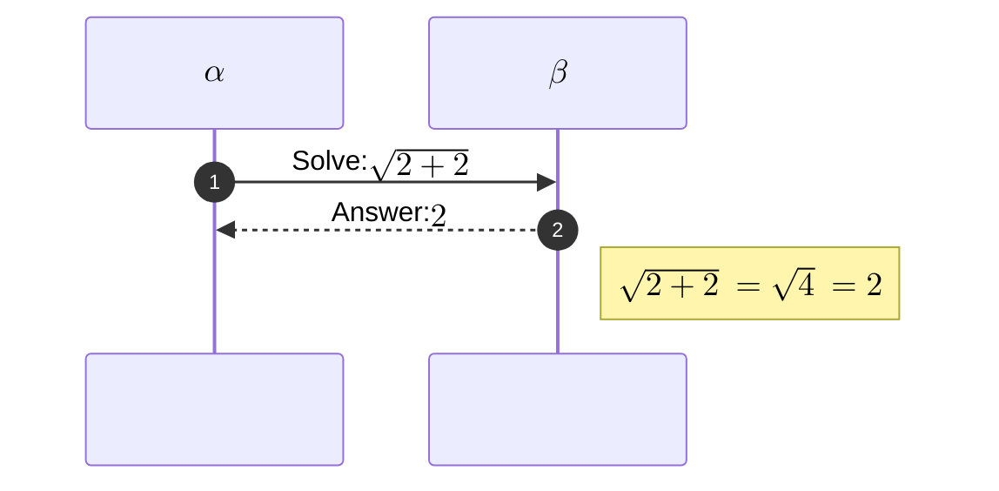

- ДЕМО: https://your-website.github.io/alente/

### Используемые технологии


HTML, CSS.

### Установка и запуск проекта

Склонируйте гит-репозиторий

> git clone <https://github.com/your-website/alente>

Установите npm-зависимости:

```bash
> npm install
```

Запустите сборку

> npm run build (production)
> npm run dev (development)
> npm run deploy (deploy на GitHubPages - когда есть build)

### Автор:

- Roman Kolpachev




This sentence uses `$` delimiters to show math inline:  $\sqrt{3x-1}+(1+x)^2$
$\sqrt{3x-1}+(1+x)^2$ asd
